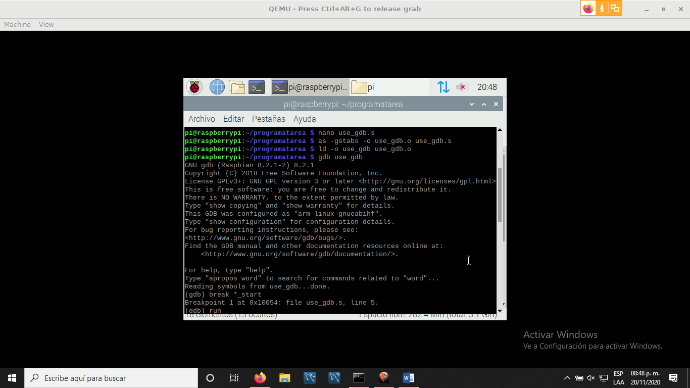
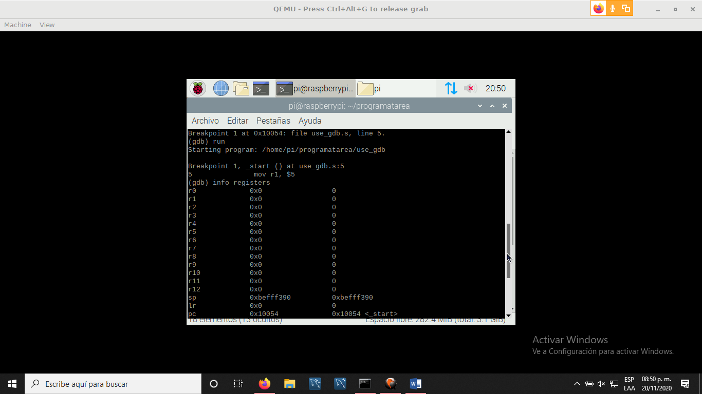
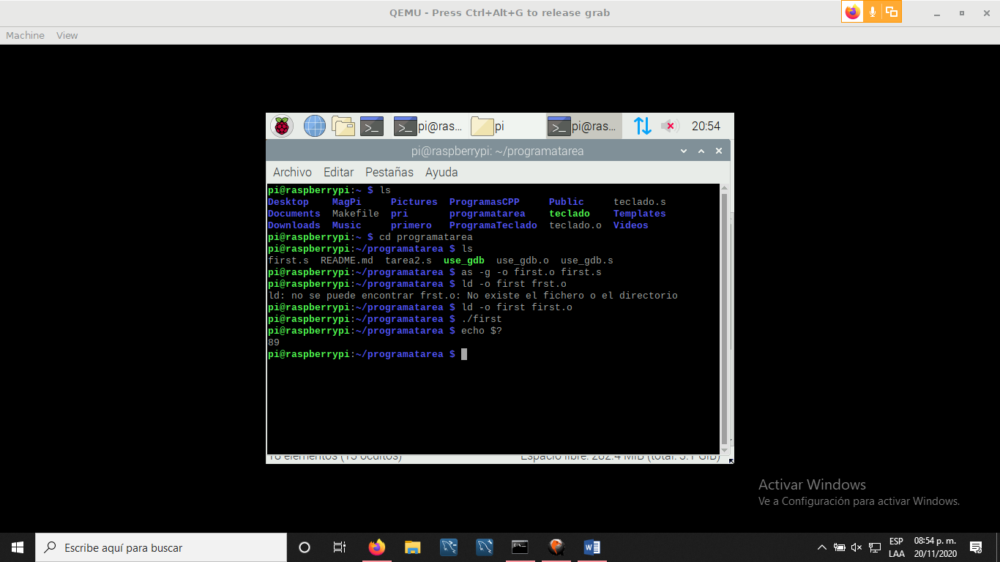
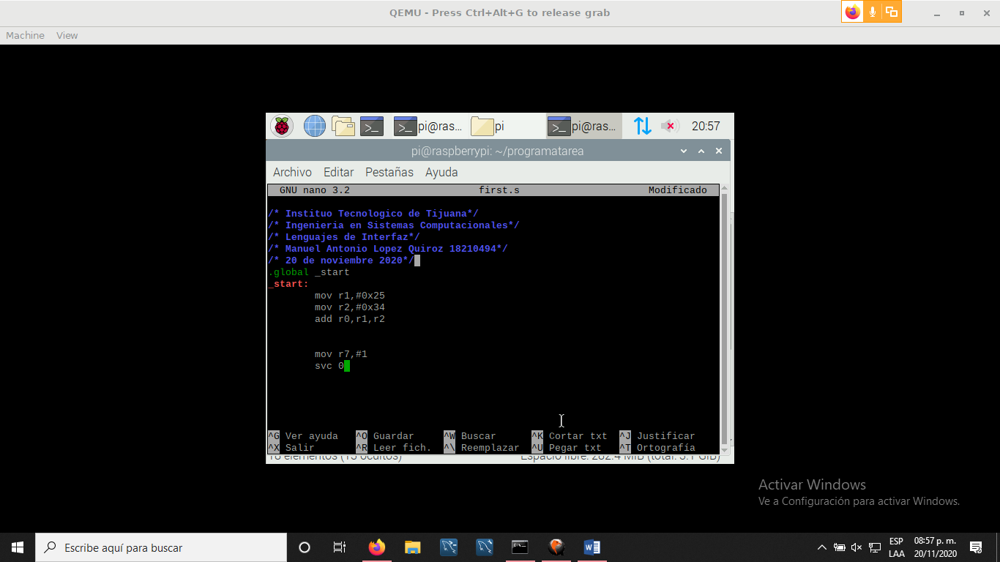

# 2.6.Ejercitar y aplicar GDB (debugger) en su QEMU-Raspbian virtual 
* * *
Este fue el programa que se uso que se llamo use_gdb.s
~~~
@ use_gdb.s
@ demo program
.section	.data
.section	.text
.globl		_start
_start:
mov r1, $5	@ load r1 with 5
cmp r1, $4	@ compare r1 with 4
sub r1, r1, $1	@ subtract 1 
cmp r1, $4      @ r1 now DOES equal 4
sub r1, r1, $1
cmp r1, $4

mov r7, $1	@ exit syscall
svc $0		@ wake kernel
.end
~~~

* * *

* * *

* * *

* * *

* * *
